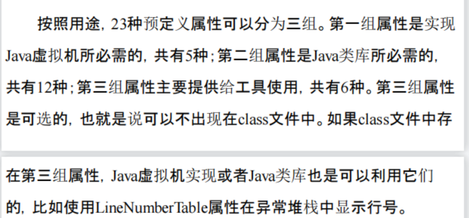

# 动手写JVM（Go版）

## Ch02
* 整体运行思路就是，先保存所有类的绝对路径
  * 包含启动类绝对路径
  * 扩展类绝对路径
  * 用户类绝对路径
* 然后开始读取用户传入的className
* 通过className匹配三个目录中的绝对路径.class文件
  * 以“启动->扩展->用户”的顺序进行className的匹配，最先匹配到的进行.class文件的读取
  * 这种形式在一定程度上实现了最简单的“双亲委派机制”（用最高的类加载器去加载类）
## Ch03
### 常量池总结
可以把常量池中的常量分为两类：字面量（literal）和符号引用（symbolic reference）。字面量包括数字常量和字符串常量，符号引
用包括类和接口名、字段和方法信息等。除了字面量，其他常量都是通过索引直接或间接指向CONSTANT_Utf8_info常量

## 问题
* 什么是函数式编程
* go的interface的使用
### ch03
* P100 关于decodeMUTF8方法的完整版记得实现，当前是简易版（不含null和补充字符）
* utf8的类型存储的是什么？它的存储和string常量有什么区别？
  * CONSTANT_String_info本身不存放字符串数据，只存了常量池索引，这个索引指向一个一个utf8常量
* class文件中所有的具体值都是存在常量池中，其他的包括string_Info，class_info都是存常量池索引
* class_info 存的具体值
* 需要实现ch03\cp_invoke_dynamic.go P112
* 类文件中的属性是什么？用来做什么？
  * 要把P120左右的全部属性含义，以及会出现的地方进行学习
  * 什么是字节码？和.class文件不同吗?