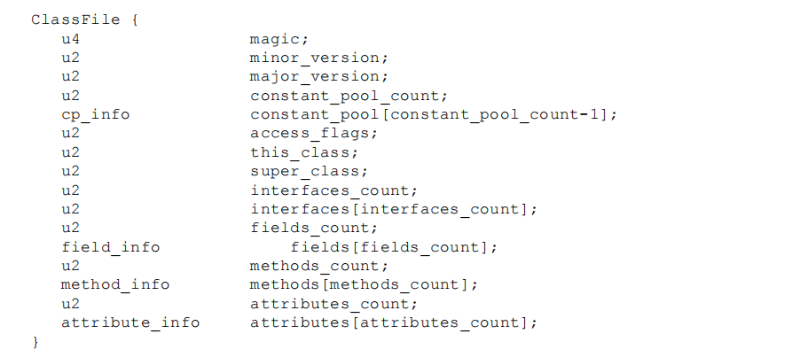
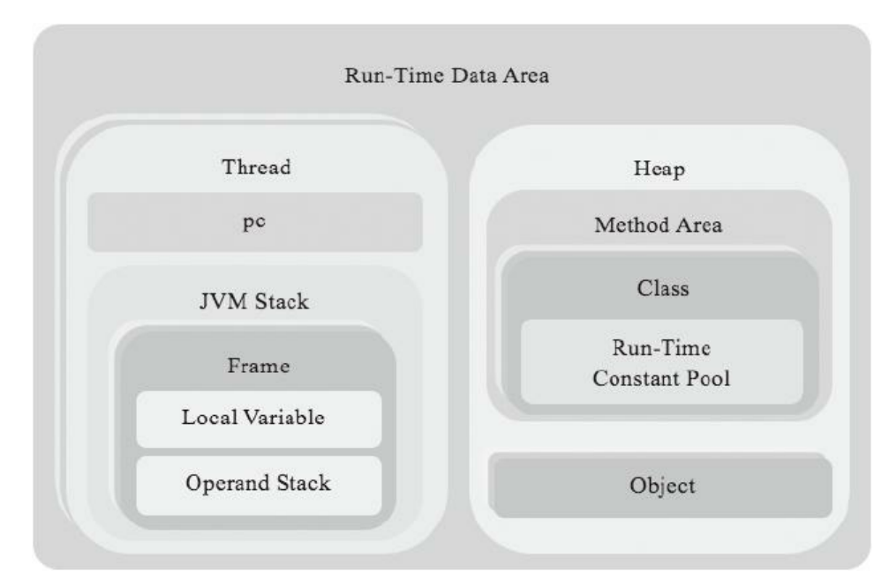

# 动手写JVM（Go版）

## Ch02
* 整体运行思路就是，先保存所有类的绝对路径
  * 包含启动类绝对路径
  * 扩展类绝对路径
  * 用户类绝对路径
* 然后开始读取用户传入的className
* 通过className匹配三个目录中的绝对路径.class文件
  * 以“启动->扩展->用户”的顺序进行className的匹配，最先匹配到的进行.class文件的读取
  * 这种形式在一定程度上实现了最简单的“双亲委派机制”（用最高的类加载器去加载类）
## Ch03
### 常量池总结
可以把常量池中的常量分为两类：字面量（literal）和符号引用（symbolic reference）。字面量包括数字常量和字符串常量，符号引
用包括类和接口名、字段和方法信息等。除了字面量，其他常量都是通过索引直接或间接指向CONSTANT_Utf8_info常量

### 此章代码逻辑
1. 先通过Ch02编写的ReadClass()将Class文件内容读取并保存
2. 再使用ClassFile.Parse()进行内容解析
3. 将ClassData赋值到ClassReader（对位的封装）
4. 再使用ClassFile的read进行读取，本质就是根据每个属性内容的固定长度进行读取。

## Ch04

本章就是实现了部分Java运行时数据结构，下一张会进行具体使用。

## Ch05
Java虚拟机规范把定义的205条指令按用途分成了11类，本章只实现其中的9类。

## 问题
* 什么是函数式编程
* go的interface的使用
### ch03
* P100 关于decodeMUTF8方法的完整版记得实现，当前是简易版（不含null和补充字符）
* utf8的类型存储的是什么？它的存储和string常量有什么区别？
  * CONSTANT_String_info本身不存放字符[README.md](README.md)串数据，只存了常量池索引，这个索引指向一个一个utf8常量
* class文件中所有的具体值都是存在常量池中，其他的包括string_Info，class_info都是存常量池索引
* class_info 存的具体值
* 需要实现ch03\cp_invoke_dynamic.go P112
* 类文件中的属性是什么？用来做什么？
  * 要把P120左右的全部属性含义，以及会出现的地方进行学习
  * 什么是字节码？和.class文件不同吗?
  * SourceFile属性是做什么用的？
* localVariableTableAttribute
### ch04
* 浮点数有什么细节？需要具体了解一下。
  * 到底有什么特点？
* 操作数栈中为什么要将float变量先转成int类型，然后再按int变量处理？
* stack的PopLong原理是什么？那个|是什么意思？
### ch05
* 有符号位移和无符号位移有什么区别？
* math的sh.go的位运算的具体实现，看懂并且总结。
* 它的整个抽象结构要总结一下
* instructions/conversions/d2x.go这部分强制转换是使用的go自带的内容，要看一下Java源码，实现更加底层的原理。
* comparisons/部分的跳转流程这里的逻辑是什么？
* java的switch有两种实现，可以看一看具体有什么区别（生成一篇博客）
* 栈帧保存的什么？它的跳转意味着什么？在一个完整程序中，它是怎么跳转的？
* extended/wide.go这部分的扩展指令基本不太懂

